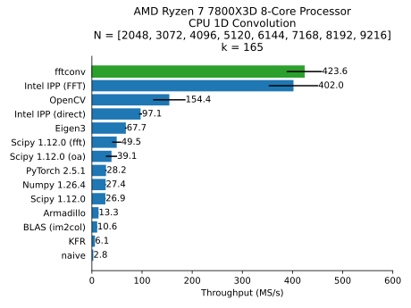
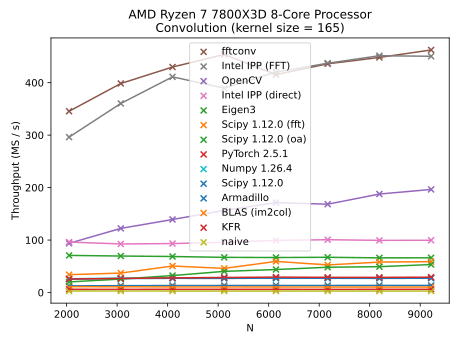
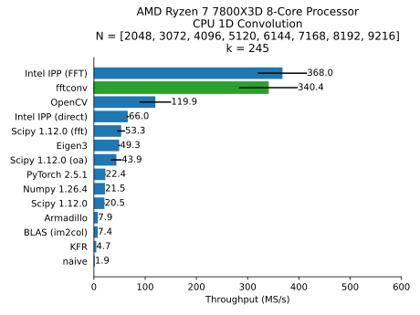
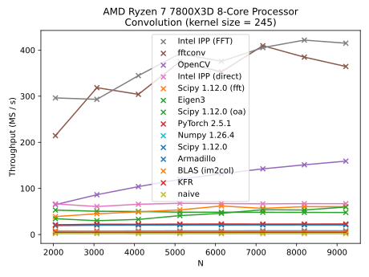
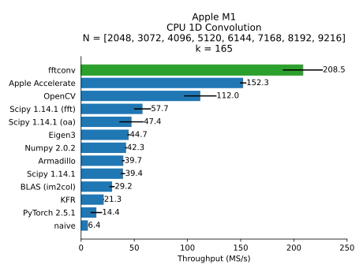
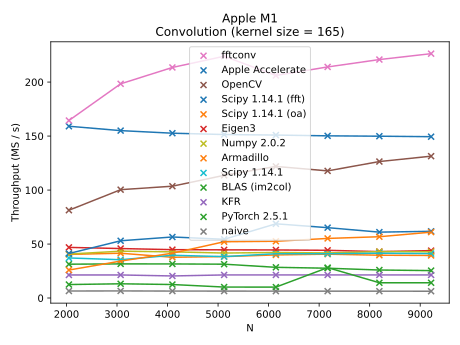
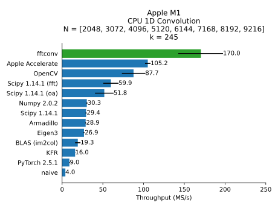
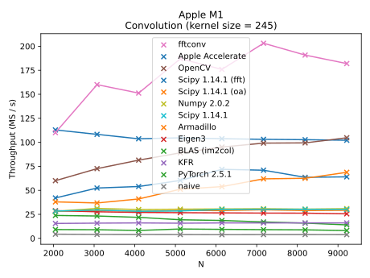

# Conv1d (CPU)

### Intel i9-13900K

Compiler: MSVC 19.40.33812

Kernel size = 165

Kernel size = 245

### AMD

Compiler: MSVC 19.40.33812

_Note: This CPU supports AVX512 but FFTW3 built from VCPKG only supports up to AVX2_

Kernel size = 165

Kernel size = 245

### Apple M1

Compiler: Apple clang 16.0.0

Kernel size = 165

Kernel size = 245

