# Hilbert benchmarks

### Intel i9-13900K

**Float32**

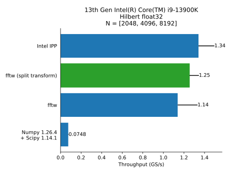
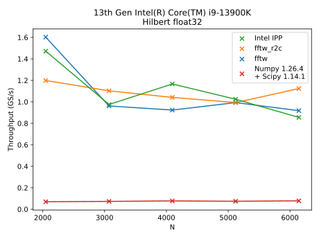

**Float64**

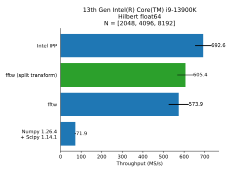
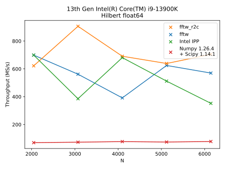

### Intel i5-6400

**Float32**

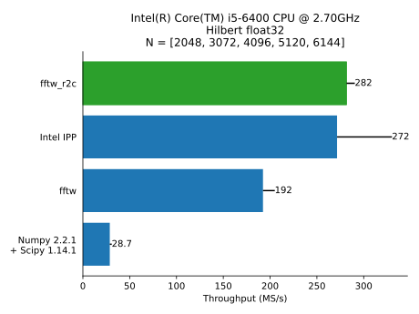
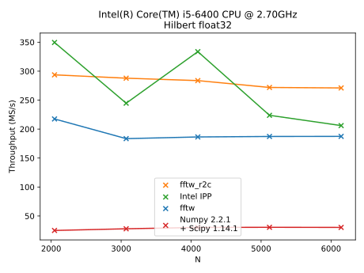

**Float64**

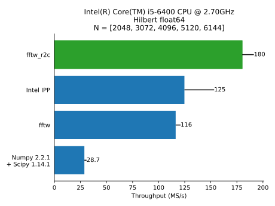
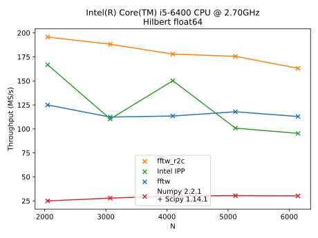

### Apple M1

**Float32**

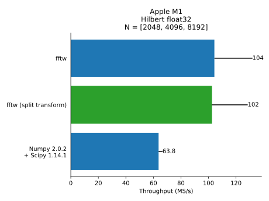
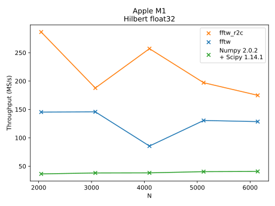

**Float64**

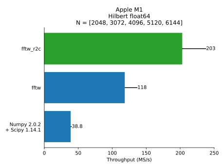
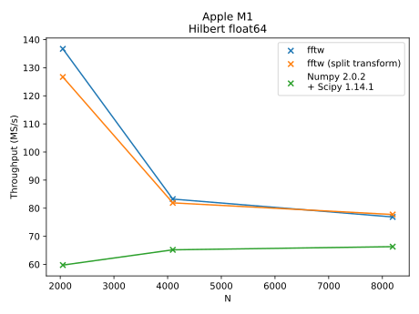

## Scale and magnitude

### Intel i9-13900K

**Float32**

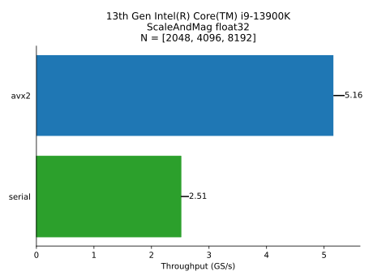
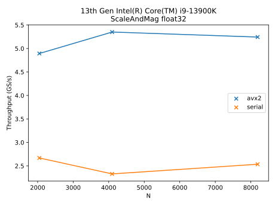

**Float64**

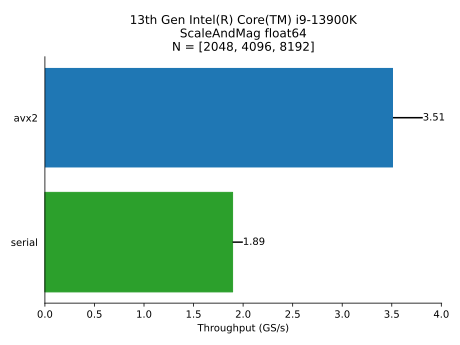
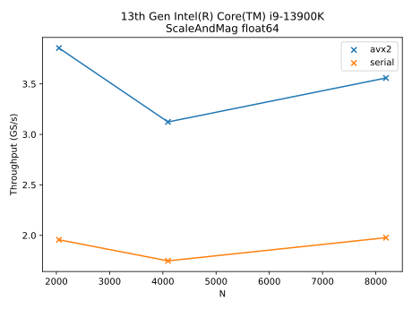

### Apple M1

**Float32**

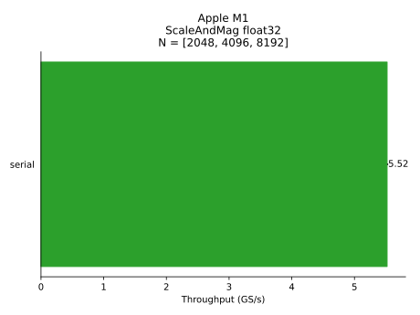
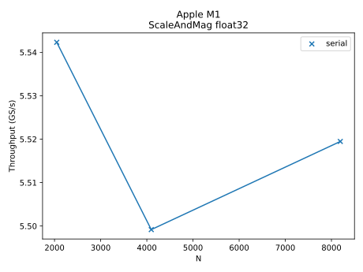

**Float64**

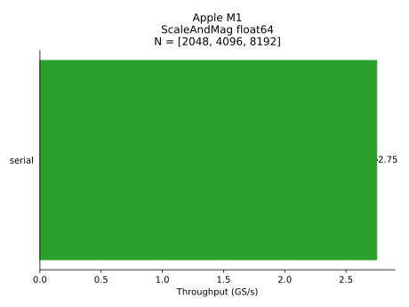
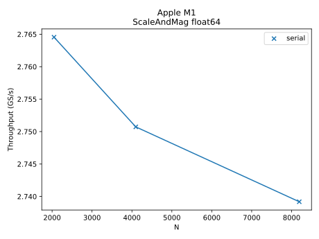

