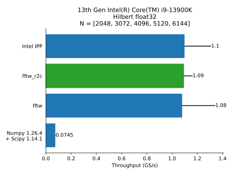
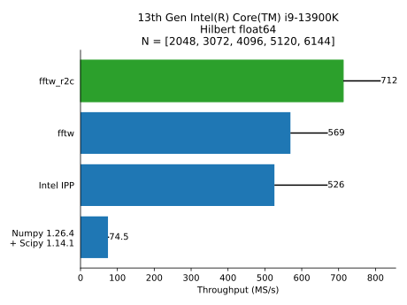
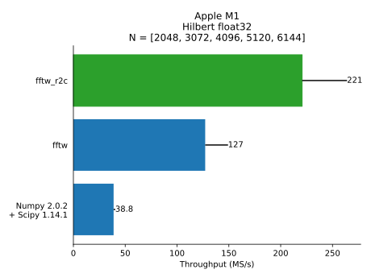
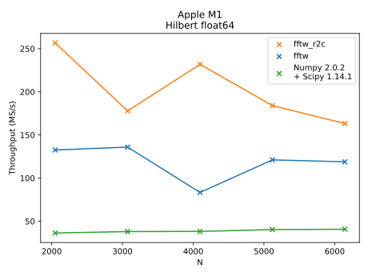

# Hilbert benchmarks

### Intel i9-13900K

**Float32**

**Float64**

### Intel i5-6400

**Float32**

**Float64**

### Apple M1

**Float32**

**Float64**

## Scale and magnitude

### Intel i9-13900K

**Float32**

**Float64**

### Apple M1

**Float32**

**Float64**

